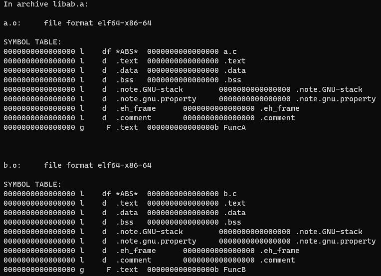

# Difference of function address in object file, static library, shared library and elf

```c
// a.c
void FuncA(void)
{
}
```

```c
// b.c
void FuncB(void)
{
}
```

```c
// main.c
int main(void)
{
    return 0;
}
```

```bash
gcc -c a.c
gcc -c b.c
```

```bash
objdump -t a.o
objdump -t b.o
```


```bash
ar rcs libab.a a.o b.o
objdump -t libab.a
```



And let's use `grep` command to show `FuncA` and `FuncB` only.

```bash
objdump -t libab.a | grep Func
```


**Conclusion**
Static libraries are just an overlay of symbol tables of different source files, and different function addresses across symbol tables are not comparable.

```bash
gcc -shared a.c b.c -o libab.so
objdump -t libab.so | grep Func
```


**Conclusion**
The addresses of functions in a shared library are comparable, but they are virtual addresses only.

```bash
gcc a.c b.c main.c -o ab
objdump -t ab | grep Func
```


**Conclusion**
The addresses of functions in an executable file are available for comparison.
