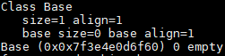
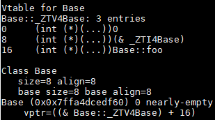
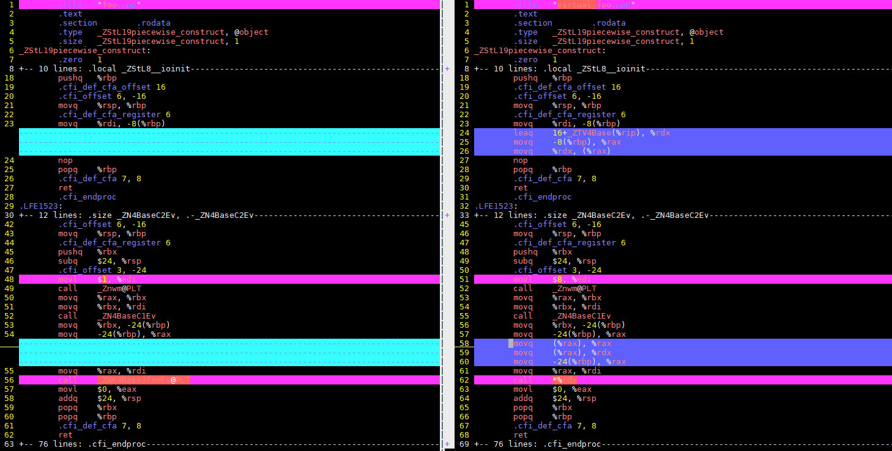

# How to avoid "zombie" virtual function in C++

## Background

virtual is an important feature in C++. In a C++ class, a function declared as virtual indicates that it can be overridden by a subclass, thus achieving runtime binding, i.e. dynamic polymorphism, and improving the flexibility of the program.

But flexible code does not always mean good code. The abuse of virtual function can also lead to unnecessary waste of time and space resources. I call this "zombie" virtual functions.

This article analyzes the way virtual function is implemented internally with a few small examples to show the proper use of virtual function.

## Problem 1: The virtual destructor

We often see destructors declared as virtual in code, so that when a subclass is deleted, it can also delete the memory of the base class. But do all C++ classes need to do this?

Let's look at the size of the Base class

```cpp
class Base {
public:
    Base () {}
    ~Base() {}
};

Base b;
```

`sizeof(b) == 1`

Here Base is an empty class, so why is there memory overhead? This is because C++ adds a memory size of 1 char to the empty class by default, allowing the class to allocate an address in memory.

If we make the following changes.

```cpp
class Base {
public:
    Base () {}
    virtual ~Base() {}
};

Base b;
```

`sizeof(b) == 8`

Why would making a destructor virtual cause the size of a class instance to increase so much?

It has to do with C++'s support for polymorphism. When a class contains a virtual function, an instance of that class automatically creates a pointer to the virtual function table. The size of a pointer is 4 bytes. Adding the default 1 byte makes it 5 bytes, plus the byte alignment operation, so the `Base` object becomes 8 bytes in size.

*Conclusion: The destructor needs to be set to virtual only if a class needs to be inherited.*

## Problem 2: virtual member functions

Many programmers often declare functions as virtual in the base class for future extensibility so that they can be overridden in subclasses later. But we often overestimate our memory and our ability to judge the future. As the amount of code grows, so does the number of virtual functions that are never overridden by subclasses. So just what are the implications of these zombie virtual member functions?

Let's take a look at the impact of virtual on storage space with an example

```cpp
class Base {
public:
    Base () {}
    ~Base() {}

    void foo (void) const;
};
```

Use gcc's `-fdump-class-hierarchy` option to figure out how `Base` is structured in memory
If you encounter an error reporting: `unrecognized command line option ‘-fdump-class-hierarchy`, check your gcc version and try `-fdump-lang-class` .[(reference)](https://gcc.gnu.org/bugzilla/show_bug.cgi?id=89712)



As concluded before, a class with no data variables has a memory size of 1.

At this point we change foo to virtual and see what the difference is.



The size of `Base` becomes 8 bytes (x86_64 Ubuntu). This is because the C++ compiler internally supports dynamic calls to virtual functions through the virtual function table. So every object of the `Base` class needs to introduce a vTable pointer to the virtual function table, i.e. the "vTable for Base" section above. vTable shows the address of the Base::foo function.

Take a look at the time overhead of virtual functions. For non-virtual functions, the function address offsets are determined directly at compile time. For virtual functions, the call is made through the vTable pointer, which is an indirect call. This difference is reflected in the number of instructions, which affects the timing.

```cpp
Base *b = new Base();
b -> foo();
```

Use `g++ -S <file name>` to take a look at the assembly of the `b -> foo()` line of code, and show their difference by `vimdiff` .



Obviously, the instruction count overhead is a bit larger for indirect calls.

*Conclusion: Member functions need to be declared as virtual only if they need to be overridden by a subclass.*
